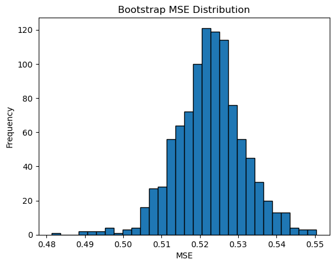

## Lab Solution Code
```python
import numpy as np
import pandas as pd
import matplotlib.pyplot as plt
from sklearn.datasets import fetch_california_housing
from sklearn.utils import resample
from sklearn.linear_model import LinearRegression
from sklearn.metrics import mean_squared_error

# Load data
data = fetch_california_housing()
df = pd.DataFrame(data.data, columns=data.feature_names)
df['MedHouseVal'] = data.target

# Bootstrap setup
bootstrap_samples = 1000
bootstrap_mse = []

for _ in range(bootstrap_samples):
    # Resample the data
    indices = resample(np.arange(len(df)), n_samples=len(df))
    X_resampled = df.iloc[indices][data.feature_names]
    y_resampled = df.iloc[indices]['MedHouseVal']
    
    # Train model
    model = LinearRegression()
    model.fit(X_resampled, y_resampled)
    predictions = model.predict(X_resampled)
    
    mse = mean_squared_error(y_resampled, predictions)
    bootstrap_mse.append(mse)

# Result 1
# Plotting the distribution of MSE
plt.hist(bootstrap_mse, bins=30, edgecolor='black')
plt.title('Bootstrap MSE Distribution')
plt.xlabel('MSE')
plt.ylabel('Frequency')
plt.show()

# Result 2
# Calculating the 95% Confidence Interval for MSE
conf_interval = np.percentile(bootstrap_mse, [2.5, 97.5])
print("95% Confidence Interval for MSE:", conf_interval)
```
## Result interpretation
### Result 1


This just shows the distribution of the Mean Squared Error (MSE) values obtained from the bootstrap resampling process. We can observe a close-to-normal distribution of the MSE values.

### Result 2
```
95% Confidence Interval for MSE: [0.50520477 0.54095449]
```

This is just the confidence interval of MSE, which can be used for comparing any bias of individual samples. Other than MSE, other metrics such as mean or proportions can also be used for the samme purpose. 