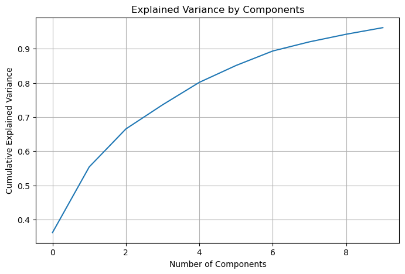
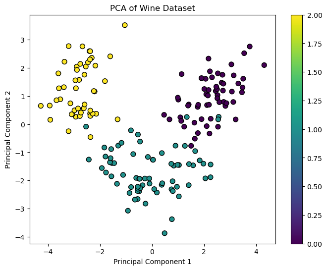
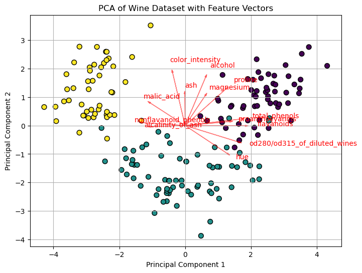

# Lab Solution
```python
# Import necessary libraries
import numpy as np
import pandas as pd
import matplotlib.pyplot as plt
from sklearn.datasets import load_wine
from sklearn.preprocessing import StandardScaler
from sklearn.decomposition import PCA

# Load the wine dataset
data = load_wine()
X = data.data
y = data.target
features = data.feature_names

# Explore the dataset
print("Dataset shape:", X.shape)
print("Features:", features)

# Normalize the features
scaler = StandardScaler()
X_scaled = scaler.fit_transform(X)

# Implement PCA
pca = PCA(n_components=0.95)  # retain 95% of the variance
X_pca = pca.fit_transform(X_scaled)

# Explained variance
explained_variance = pca.explained_variance_
explained_variance_ratio = pca.explained_variance_ratio_

# Result 1
# Print PCA results
print("\nPCA Results:")
print("{:<20} {:<20} {:<20}".format("Principal Component", "Variance Explained", "Percentage of Variance Explained"))
sum_percentage = 0
for i, (var, ratio) in enumerate(zip(explained_variance, explained_variance_ratio)):
    print("{:<20} {:<20} {:<20.2%}".format(f"PC{i+1}", var, ratio))
    sum_percentage+=ratio
print("\nPercentage of Variance Explained by PCA:",sum_percentage)

# Result 2
# Cumulative variance explained
plt.figure(figsize=(8, 5))
plt.plot(np.cumsum(pca.explained_variance_ratio_))
plt.xlabel('Number of Components')
plt.ylabel('Cumulative Explained Variance')
plt.title('Explained Variance by Components')
plt.grid(True)
plt.show()

# Result 3
# Scatter plot of the first two principal components
plt.figure(figsize=(8, 6))
scatter = plt.scatter(X_pca[:, 0], X_pca[:, 1], c=y, cmap='viridis', edgecolor='k', s=50)
plt.xlabel('Principal Component 1')
plt.ylabel('Principal Component 2')
plt.title('PCA of Wine Dataset')
plt.colorbar(scatter)
plt.show()

# Result 4
# Vector plot of the first two principal components
plt.figure(figsize=(8, 6))
plt.scatter(X_pca[:, 0], X_pca[:, 1], c=y, cmap='viridis', edgecolor='k', s=50)
for i, feature in enumerate(features):
    plt.arrow(0, 0, pca.components_[0, i] * max(X_pca[:, 0]), pca.components_[1, i] * max(X_pca[:, 1]),
              color='r', alpha=0.5, head_width=0.05, head_length=0.1)
    plt.text(pca.components_[0, i] * max(X_pca[:, 0]) * 1.2, pca.components_[1, i] * max(X_pca[:, 1]) * 1.2,
             feature, color='r')
plt.xlabel('Principal Component 1')
plt.ylabel('Principal Component 2')
plt.title('PCA of Wine Dataset with Feature Vectors')
plt.grid(True)
plt.show()


```

## Result interpretation
### Result 1
```python
PCA Results:
Principal Component  Variance Explained   Percentage of Variance Explained
PC1                  4.732436977583589    36.20%              
PC2                  2.5110809296451233   19.21%              
PC3                  1.4542418678464664   11.12%              
PC4                  0.9241658668248734   7.07%               
PC5                  0.8580486765371106   6.56%               
PC6                  0.6452822124678547   4.94%               
PC7                  0.554141466245783    4.24%               
PC8                  0.350466274946254    2.68%               
PC9                  0.2905120326939769   2.22%               
PC10                 0.25232001036082496  1.93%    

Percentage of Variance Explained by PCA: 0.9616971684450641
```
The result tells you how much of the percentage of variance is explained by each principal component. We can see that the first principal component explains 36.20% of the variance, the second principal component explains 19.21%, and so on. The first ten principal components explain 96.17% of the variance in the dataset. 

Variance in PCA  has a specific meaning, though it is related to the general concept of variance. In PCA, variance is a measure of how much of the original data's variability is captured by each principal component. 

Depending on the percentage of variance you want to retain, you can use different nubmers of principal components. 

### Result 2
Plotting the percentage of variance explained out might be easier to see:



### Result 3
Becuase each principal component itself is a linear combination, we cannot interpret the principal components directly. However, we can use the first two principal components to visualize the data. The scale bar shows the orignal target labels of the wine dataset, we are including the target labels to see if the principal components can separate the data points.



### Result 4
We can also plot the vectors of the features on the scatter plot of the first two principal components. The vectors show the direction and magnitude of each feature in the principal component space.



We can observe that the directions of the vectors varie. This indicates that the features have different contributions to the principal components. For example, the "total_phenols" is relatively parallel to the first principal component, indicating that it is explained mainly by the first principal component. In constrast, "color_intensity" is more aligned with the second principal component, indicating that it is explained mainly by the second principal component. "hue" is explained by both principal components.

## Usage
PCA results can be used as input features for machine learning models. The reduced number of features can help improve the efficiency of the model and reduce the risk of overfitting. Additionally, PCA can be used for data visualization to explore the relationships between features and identify patterns in the data.
```python
from sklearn.ensemble import RandomForestClassifier
model = RandomForestClassifier()
model.fit(X_pca, y)  # Train on the PCA-transformed data
```