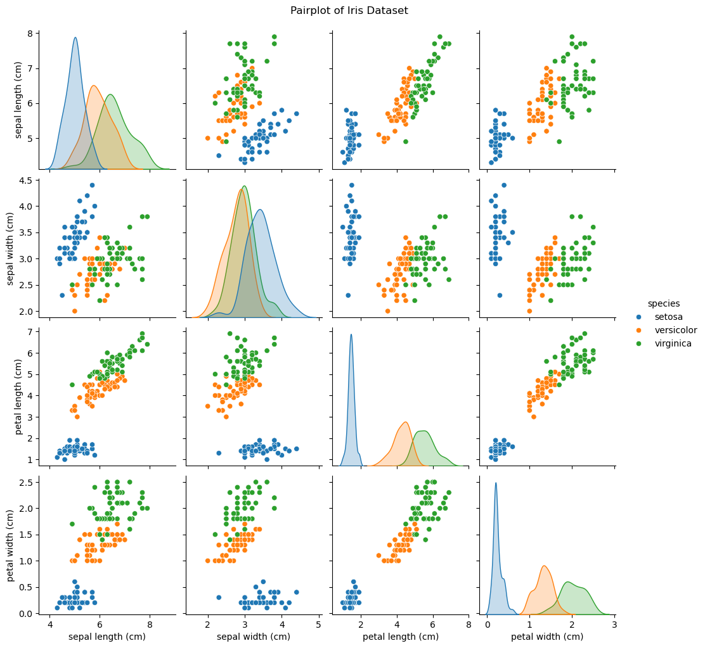
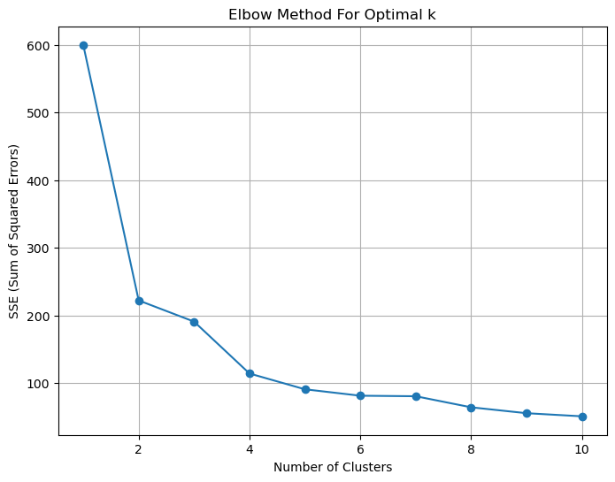
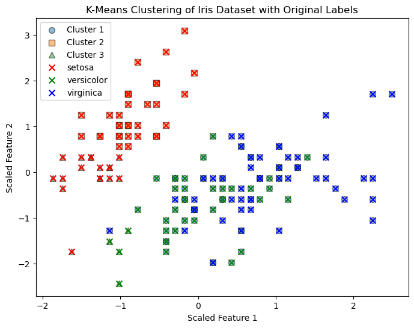
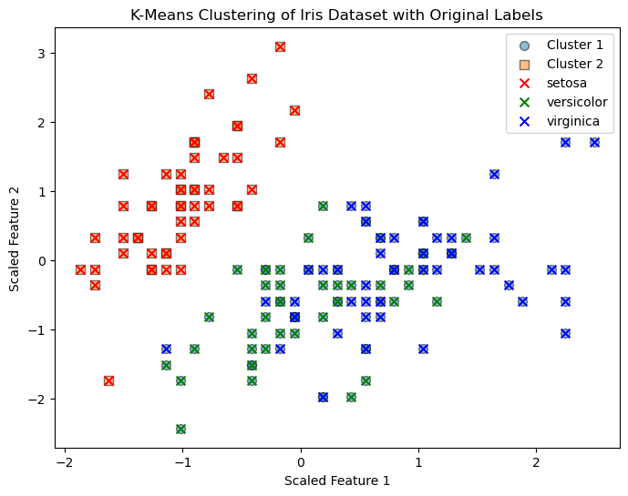

## Lab Solution Code
```python
# Import libraries
from sklearn.datasets import load_iris
from sklearn.cluster import KMeans
from sklearn.preprocessing import StandardScaler
import pandas as pd
import seaborn as sns
import matplotlib.pyplot as plt
import numpy as np  # Ensure numpy is imported

# Load data
iris = load_iris()
X = iris.data
y = iris.target
target_names = iris.target_names

# Create a DataFrame including the target labels
df = pd.DataFrame(X, columns=iris.feature_names)
df['species'] = pd.Categorical.from_codes(y, target_names)

# Result 1
# Visualize the data
pairplot = sns.pairplot(df, hue='species', diag_kind='kde')
pairplot.fig.suptitle('Pairplot of Iris Dataset', y=1.02)  # Adjust title position
plt.show()

# Scale the data
scaler = StandardScaler()
X_scaled = scaler.fit_transform(X)

# Use the elbow method to determine the optimal number of clusters
sse = []  # Sum of squared errors
range_n_clusters = list(range(1, 11))  # Testing 1 to 10 clusters
for n_clusters in range_n_clusters:
    kmeans = KMeans(n_clusters=n_clusters, random_state=42)
    kmeans.fit(X_scaled)
    sse.append(kmeans.inertia_)  # Inertia: Sum of squared distances of samples to their closest cluster center

# Result 2
# Plot the elbow graph
plt.figure(figsize=(8, 6))
plt.plot(range_n_clusters, sse, marker='o')
plt.xlabel('Number of Clusters')
plt.ylabel('SSE (Sum of Squared Errors)')
plt.title('Elbow Method For Optimal k')
plt.grid(True)
plt.show()

# Result 3
# Assuming the elbow is at 3 clusters based on the plot
kmeans_optimal = KMeans(n_clusters=3, random_state=42)
kmeans_optimal.fit(X_scaled)
labels_optimal = kmeans_optimal.labels_

# Visualize the clusters with target names as legend
plt.figure(figsize=(8, 6))
# Create a custom legend for K-means clusters
unique_labels_optimal = np.unique(labels_optimal)
markers = ['o', 's', '^']  # Different markers for different clusters

# Overlay the K-means clusters using different markers
for i, label in enumerate(unique_labels_optimal):
    plt.scatter(X_scaled[labels_optimal == label, 0], X_scaled[labels_optimal == label, 1],
                marker=markers[i], edgecolor='k', s=50, alpha=0.5, label=f'Cluster {label + 1}')

# Overlay the original labels using different colors
colors = ['r', 'g', 'b']
for i, target_name in enumerate(target_names):
    plt.scatter(X_scaled[y == i, 0], X_scaled[y == i, 1], color=colors[i], marker='x', label=target_name, edgecolor='k', s=50)

plt.xlabel('Scaled Feature 1')
plt.ylabel('Scaled Feature 2')
plt.title('K-Means Clustering of Iris Dataset with Original Labels')
plt.legend()
plt.show()
```


## Result interpretation

### Result1
In the explopratory analysis, we can create a pairplot to observe the interactions between each feature. 



Diagonal shows the distribution of each feature for each target label.

Other scatter plots show the relationship between each pair of features and what kind of characteristics each target type posesses.

> It seems like setosa is the most distinguishable from the other two types.

### Result2



The elbow point appears to be at 3, as what we can observe, from 4 onwards, the decrease in the sum of squared distances is not as significant as before.

### Result3
Now we have determined the nubmer of clusters, 
we can take a look at the scatter plot of the lable assginments.



Above plot shows the cluster asssignemnts of 3 clsuters with the original target labels. We can see that there is some overlap beweteen the assignments, but there are also some datapoints that the K-means algorithm cannot learn. 

Below is the cluster assignmetn of 2 clusters for comparison:


