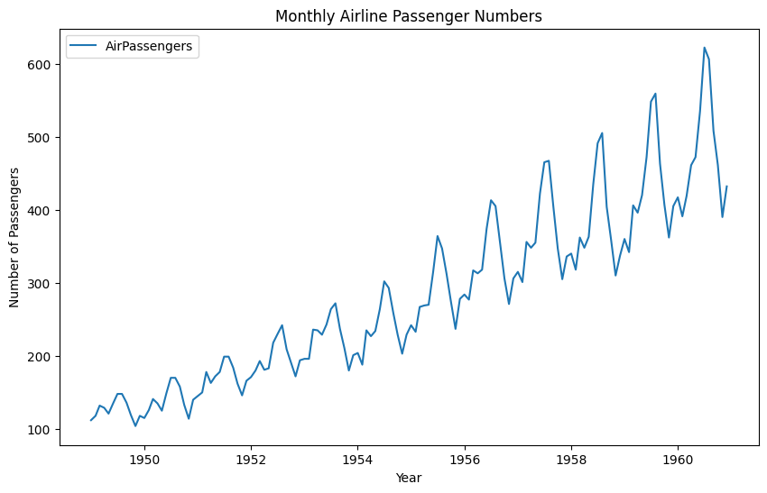
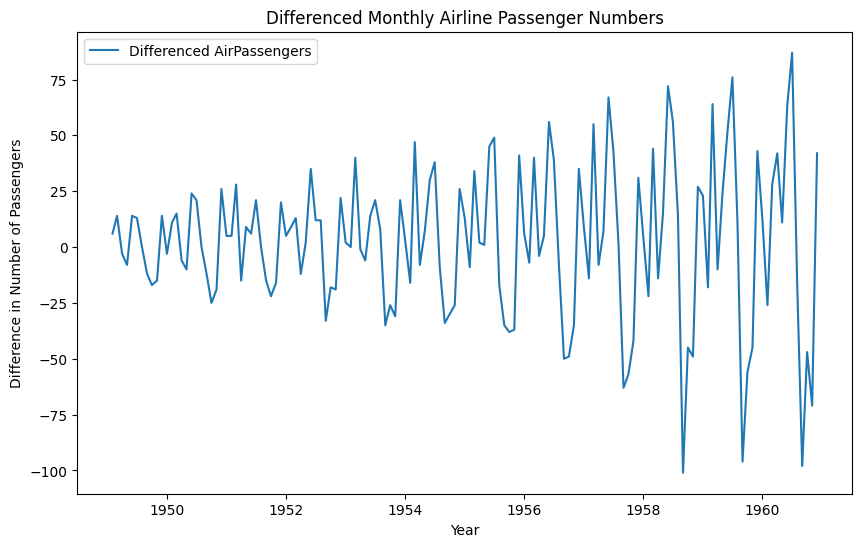
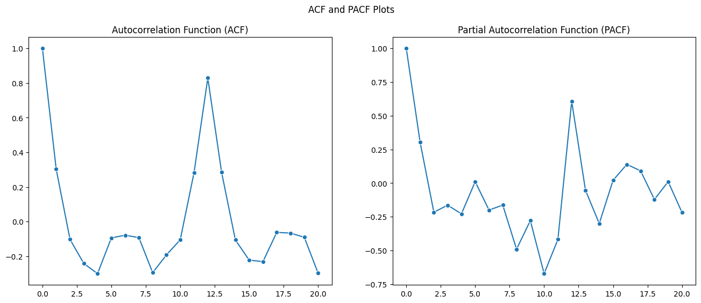
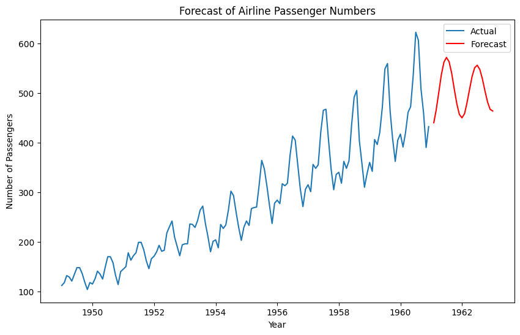

## Lab Solution Code
```python
import pandas as pd
import matplotlib.pyplot as plt
import seaborn as sns
from statsmodels.tsa.arima.model import ARIMA
from statsmodels.tsa.stattools import adfuller, acf, pacf
import numpy as np

# Load the dataset from a CSV file
data = pd.read_csv('AirPassengers.csv', parse_dates=True, index_col='Month')

# Convert 'Month' to a datetime index
data.index = pd.to_datetime(data.index, format='%Y-%m')

# Result 1
print("="*10,"Result 1", "="*10)
# Plot the time-series data
plt.figure(figsize=(10, 6))
plt.plot(data['Passengers'], label='AirPassengers')
plt.title('Monthly Airline Passenger Numbers')
plt.xlabel('Year')
plt.ylabel('Number of Passengers')
plt.legend()
plt.show()

# Result 2
print("="*10,"Result 2", "="*10)
print("Before differencing:")
# Test for stationarity
result = adfuller(data['Passengers'])
print('ADF Statistic:', result[0])
print('p-value:', result[1])
for key, value in result[4].items():
    print('Critical Value ({}): {:.3f}'.format(key, value))

# Differencing the data if it's not stationary
data_diff = data['Passengers'].diff().dropna()

# Result 3
print("="*10,"Result 3", "="*10)
print("After differencing:")
# Test for stationarity after differencing
result_diff = adfuller(data_diff)
print('ADF Statistic (Differenced Data):', result_diff[0])
print('p-value (Differenced Data):', result_diff[1])
for key, value in result_diff[4].items():
    print('Critical Value ({}): {:.3f}'.format(key, value))

# Result 4
# Plot the differenced data
plt.figure(figsize=(10, 6))
plt.plot(data_diff, label='Differenced AirPassengers')
plt.title('Differenced Monthly Airline Passenger Numbers')
plt.xlabel('Year')
plt.ylabel('Difference in Number of Passengers')
plt.legend()
plt.show()
 
# Result 5
# ACF and PACF plots
fig, ax = plt.subplots(1, 2, figsize=(16, 6))
fig.suptitle('ACF and PACF Plots')
sns.lineplot(data=pd.Series(acf(data_diff, nlags=20)), ax=ax[0], marker="o")
ax[0].set_title('Autocorrelation Function (ACF)')
sns.lineplot(data=pd.Series(pacf(data_diff, nlags=20)), ax=ax[1], marker="o")
ax[1].set_title('Partial Autocorrelation Function (PACF)')
plt.show()

# Identify ARIMA parameters based on ACF and PACF
p = 2  # AR(p) term, based on PACF plot
d = 1  # Differencing order, based on stationarity test
q = 2  # MA(q) term, based on ACF plot

model = ARIMA(data['Passengers'], order=(p, d, q))
model_fit = model.fit()

# Result 6
print("="*10,"Result 6", "="*10)
# Print the model summary
print(model_fit.summary())

# Forecast future values
forecast = model_fit.forecast(steps=24)

# Result 7
print("="*10,"Result 7", "="*10)
# Plot the forecast series
plt.figure(figsize=(10, 6))
plt.plot(data['Passengers'], label='Actual')
plt.plot(pd.date_range(start=data.index[-1], periods=25, freq='M')[1:], forecast, label='Forecast', color='red')
plt.title('Forecast of Airline Passenger Numbers')
plt.xlabel('Year')
plt.ylabel('Number of Passengers')
plt.legend()
plt.show()

```

## Result interpretation
### Result 1

Here we can see that the time-series shows a clear upward trend. The data is not stationary.

The data also exibits clear seasonality with regular peaks and troughs every year. This indicates that certain months have consistently higher or lower passenger numbers, which is common in travel and tourism related data. 


### Result 2
```python
ADF Statistic: 0.8153688792060447
p-value: 0.9918802434376409
Critical Value (1%): -3.482
Critical Value (5%): -2.884
Critical Value (10%): -2.579
```
ADF test makes the null hypothesis that the data is non-stationary.

Here we have both p-value and critical value to determine if the data is stationary or not. We can see that p-value is much greater than 0.05, in this case we cannot reject the null hypothesis. Also, the ADF statistic is greater than the critical values. Both confirms that the data is not stationary.

> If critical value is greater than the statistic at a given level, we can reject the null hypothesis and say that the data is stationary.


### Result 3
```
ADF Statistic (Differenced Data): -2.8292668241699794
p-value (Differenced Data): 0.054213290283828236
Critical Value (1%): -3.482
Critical Value (5%): -2.884
Critical Value (10%): -2.579
```
After differencing, we can see that the p-value for ADF Statistics is very close to 0.05. Also, the ADF statistic is less than the critical values at 10% and close to the critical value at 5%. This indicates that the data is liekly to be stationary.


### Result 4

This is the plot of the differenced data. We can see that the data is now stationary. 

#### Characteristics of Stationary Time Series
- Constant Mean: The mean value of the series does not change over time.
- Constant Variance: The variance around the mean is constant over time.
- No Long-Term Trend: The series does not exhibit long-term upward or downward trends.
- No Seasonality: The series does not have periodic fluctuations.

#### Visual Indicators of Stationarity
- Mean Reversion: The series tends to hover around a constant mean.
- Consistent Variance: The fluctuations around the mean are roughly constant.
- Lack of Trend: There is no noticeable trend in the data.
- No Seasonal Patterns: There are no repeating patterns at regular intervals.

In the plot above, we can see that although there is still some seasonality in the data, the mean and variance are relatively constant over time. Differencing does not remove seasonal patterns unless seasonal differencing is applied.

### Result 5

#### Choosing q
Looking at the ACF plot, we can see that the spike at lag 1 is significant, the spike at 12 is also significant. This may indicate that the data has a yearly seasonality. The rest of the spikes are not significant, which means that the past values are not influencing the current value as much. 

Observe that the autocorrelation decreased from a positive value to a negative value after lag 2. We choose choose the cutoff point as the lag. In this case we choose q=2.

#### Choosing p
Looking at the PACF plot, we can see that the spike lag at 1, 12 are siginificant as well. In a similar way, we choose the cutoff point as the lag. In this case we choose p=2.


> This [Summary of rules for identifying ARIMA models](https://people.duke.edu/~rnau/arimrule.htm) provides very good guidelines for identifying ARIMA models.

### Result 6
```
                               SARIMAX Results                                
==============================================================================
Dep. Variable:             Passengers   No. Observations:                  144
Model:                 ARIMA(2, 1, 2)   Log Likelihood                -671.673
Date:                Mon, 22 Jul 2024   AIC                           1353.347
Time:                        15:46:47   BIC                           1368.161
Sample:                    01-01-1949   HQIC                          1359.366
                         - 12-01-1960                                         
Covariance Type:                  opg                                         
==============================================================================
                 coef    std err          z      P>|z|      [0.025      0.975]
------------------------------------------------------------------------------
ar.L1          1.6850      0.020     83.060      0.000       1.645       1.725
ar.L2         -0.9548      0.017    -55.420      0.000      -0.989      -0.921
ma.L1         -1.8432      0.124    -14.831      0.000      -2.087      -1.600
ma.L2          0.9953      0.135      7.391      0.000       0.731       1.259
sigma2       665.9626    113.951      5.844      0.000     442.623     889.303
===================================================================================
Ljung-Box (L1) (Q):                   0.30   Jarque-Bera (JB):                 1.84
Prob(Q):                              0.59   Prob(JB):                         0.40
Heteroskedasticity (H):               7.38   Skew:                             0.27
Prob(H) (two-sided):                  0.00   Kurtosis:                         3.14
===================================================================================

Warnings:
[1] Covariance matrix calculated using the outer product of gradients (complex-step).
```
Observe that the the AR(p) and MA(q) terms are significant with p-values less than 0.05. This indicates that the model is a good fit for the data. 

The Ljung-Box test is a test for the null hypothesis that the residuals are independently distributed. The p-value(0.59) is greater than 0.05, which means that we cannot reject the null hypothesis. This indicates that the residuals do not have significant autocorrelation, implying that the model is capturing most of the time series' patterns effectively, and thus the model is a good fit for the data.

The Jarque-Bera test is a test for the null hypothesis that the residuals are normally distributed. The p-value(0.40) is greater than 0.05, which means that we cannot reject the null hypothesis. This indicates that the residuals are normally distributed, which is a good sign for the model.

The Heteroskedasticity test is a test for the null hypothesis that the residuals have constant variance. The p-value(0.00) is less than 0.05, which means that we can reject the null hypothesis. This indicates that the residuals do not have constant variance, which is a bad sign for the model.

> You can address the heteroskedasticity issue by transforming the data or using a different model.

### Result 7

The red line represents the forecasted values. We can see that the forecasted values follow the trend of the actual values. The forecasted values are based on the ARIMA model we built. 